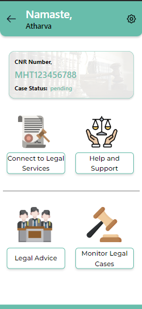

# NyaySetu

## Problem Overview

	
To develop technology-driven solutions that address the challenges faced by undertrial prisoners in India, including legal aid, access to justice, and rehabilitation.

## Proposed Solution

We pressent you NyaySetu!!
Nyaysetu is a platform that connects undertrial prisoners with pro bono lawyers, legal clinics, and legal aid organizations including UTRCs for bail process and providing legal aid to them, including legal representation, access to court proceedings, and legal resources.
NyaySetu act as a mordern yet simple interface that connects undertrial prisoners and legal organizations in one streamlined flow with a very intutive user interface.

## Features of Proposed Solution

- User-Friendly and Polished UI
- Prisoner's authentication by logging in through unquie prisoner's CNR Number
- Connects undertrial prisoners with pro bono lawyers, legal clinics
- Dashboard that tracks and monitors the status and progress of undertrial prisoners
- Provide education, vocational training, and mental health support to undertrial prisoners
- Reducing recidivism rates and promoting social reintegration

## Screenshots

## Team Members

- Toyash Patil
- Jiya Trivedi
- Atharva Upare
- Ojas Chatur
- Rashi Joisher

